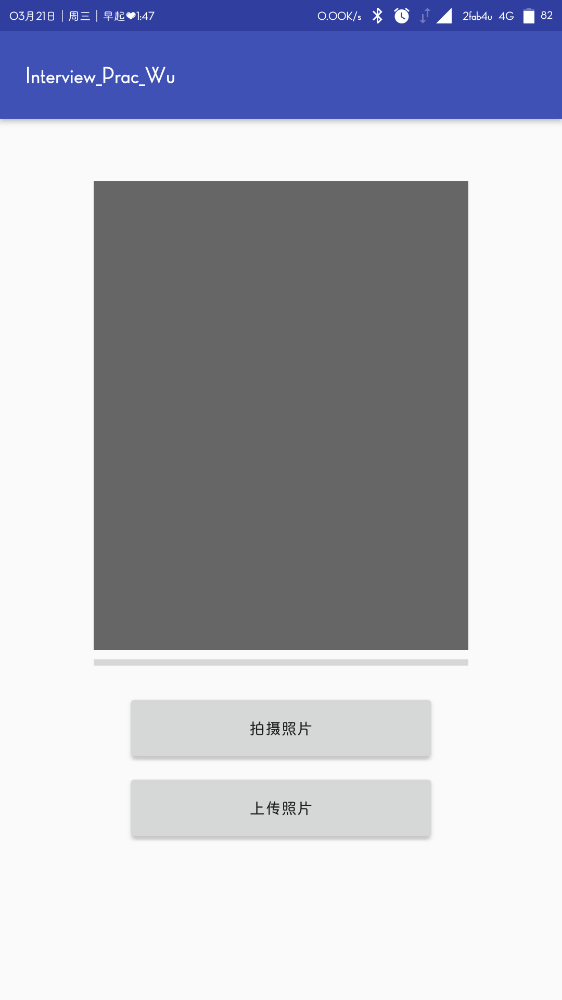
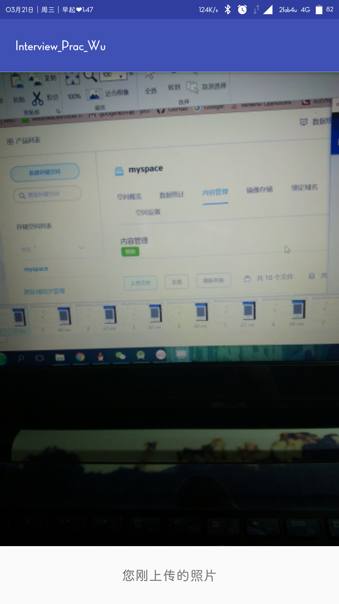

# InterView_Prac_uweii
A practice for an interview

#集成七牛云的小demo。 调用系统相机，拍摄照片 
传到七牛云空间，并显示。 
##涉及
1. 动态请求权限【写sd卡】
2. 查看是否开启网络
3. 重写keyDown【上传图片时不允许按返回键】
4. 图片压缩【相机拍摄的图片像素太高，原图显示会oom，于是压缩并显示】
5.  intent传递数据【从上传图片activity到显示上传过的图片activity】
6. 保存文件到本地【包含创建文件夹】
7. ProgressBar的使用【显示图片上传的进度】
8. Picasso
###
使用七牛云sdk，以及 picasso 显示图片。

## 效果图

